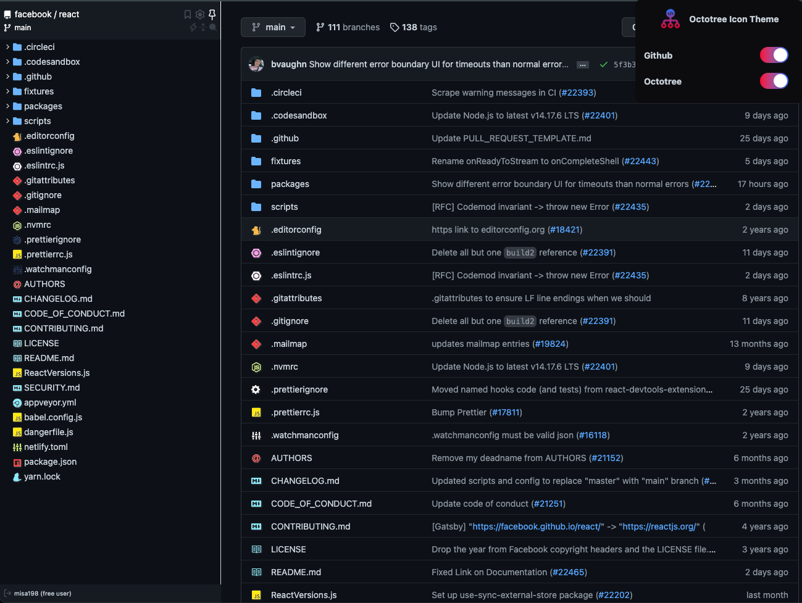

<h1 align="center">

Octotree Icon Theme
</h1>

  
  
  

## Overview

A Browser Extension which gives different filetypes different icons to GitHub and Octotree for free.
Support Chromium Browsers and Firefox.

  

## Installation

- For Microsoft Edge Chromium

  

- For Firefox

- For other Chromium browser:
   
  Download from <a href="https://github.com/misa198/octotree-icon-theme/releases">
  here
  </a> and follow the instructions [here](https://www.quora.com/How-do-I-install-a-chrome-extension-from-a-zip-file).

## License

[MIT](./LICENSE)
