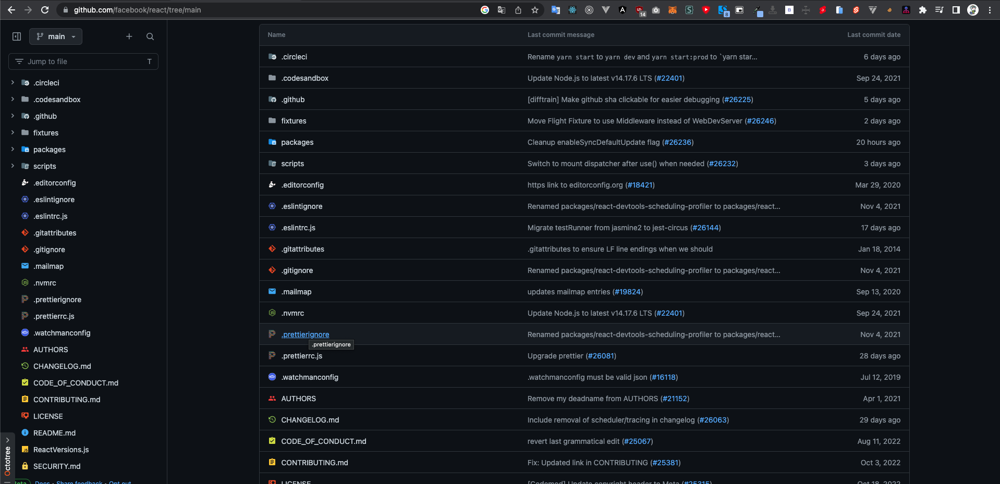

<h1 align="center">

Octotree Theme
</h1>

  
  
  

  
  

## Overview

A browser extension which gives different filetypes different icons, and code color theme to GitHub and Octotree for free.

Support Chromium Browsers and Firefox.

  

 

  

  

## Themes

## Icons themes

#### Material icons theme

  
View details

   

  
  

#### Atom icons theme

  
View details

   

  

### Code color thems

  
View details

   
  
  - Default (Default Github theme)
  - Ambiance
  - Ayu mirage
  - Chaos
  - Clouds midnight
  - Cobalt
  - Dracula
  - Github dark
  - Idle fingers
  - Kr theme
  - Merbivore soft
  - Merbivore
  - Mono industrial clear
  - Mono industrial
  - Monokai spacegray eighties
  - Monokai
  - Obsidian
  - One dark
  - Pastel on dark
  - Railscasts
  - Solarized dark
  - Terminal
  - Tomorrow night blue
  - Tomorrow night bright
  - Tomorrow night eighties
  - Tomorrow night
  - Twilight
  - Vibrant ink

## Installation

- Click the icon on the top of the page that matches your browser.
- For other Chromium browser:
   
  Download from <a href="https://github.com/misa198/octotree-theme/releases">
  here
  </a> and follow the instructions [here](https://www.quora.com/How-do-I-install-a-chrome-extension-from-a-zip-file).

## Credits

- [@StylishThemes](https://github.com/StylishThemes) for [GitHub Dark](https://github.com/StylishThemes/GitHub-Dark/)

- [@PKief](https://github.com/PKief) for [Material Icon Theme](https://github.com/PKief/vscode-material-icon-theme)

## License

[BSD 2-Clause "Simplified" License](./LICENSE)

## Support me

