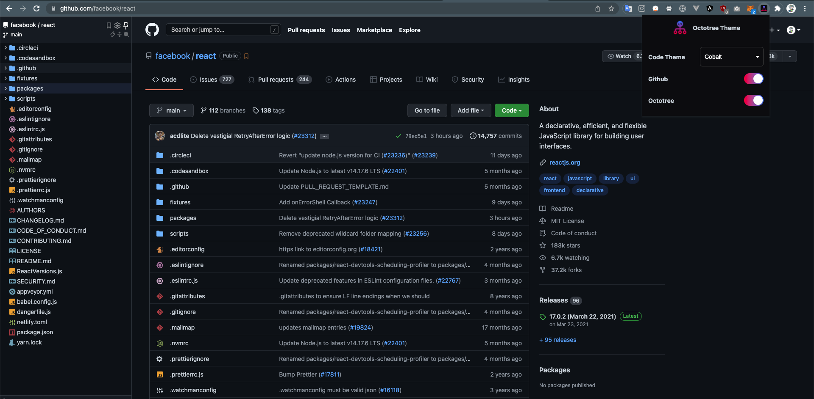
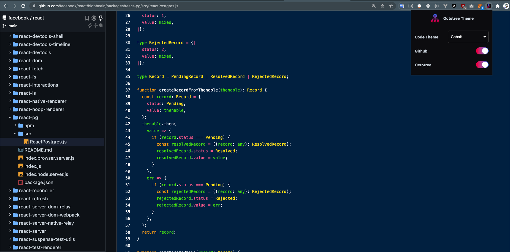

<h1 align="center">

Octotree Theme
</h1>

  <a href="https://chrome.google.com/webstore/detail/meagmbmaaljhgdcglcmflnnglpokldcj">
    
  
  

  
  

## Overview

A browser extension which gives different filetypes different icons, and code color theme to GitHub and Octotree for free.

Support Chromium Browsers and Firefox.

  

 

  

## Themes

- Default (Default Github theme)
- Ambiance
- Ayu mirage
- Chaos
- Clouds midnight
- Cobalt
- Dracula
- Github dark
- Idle fingers
- Kr theme
- Merbivore soft
- Merbivore
- Mono industrial clear
- Mono industrial
- Monokai spacegray eighties
- Monokai
- Obsidian
- One dark
- Pastel on dark
- Railscasts
- Solarized dark
- Terminal
- Tomorrow night blue
- Tomorrow night bright
- Tomorrow night eighties
- Tomorrow night
- Twilight
- Vibrant ink

## Installation

- For Google Chrome

  

- For Microsoft Edge Chromium

  

- For Firefox

  

- For other Chromium browser:
   
  Download from <a href="https://github.com/misa198/octotree-theme/releases">
  here
  </a> and follow the instructions [here](https://www.quora.com/How-do-I-install-a-chrome-extension-from-a-zip-file).

## Credits

- [@StylishThemes](https://github.com/StylishThemes) for [GitHub Dark](https://github.com/StylishThemes/GitHub-Dark/)

## License

[BSD 2-Clause "Simplified" License](./LICENSE)
